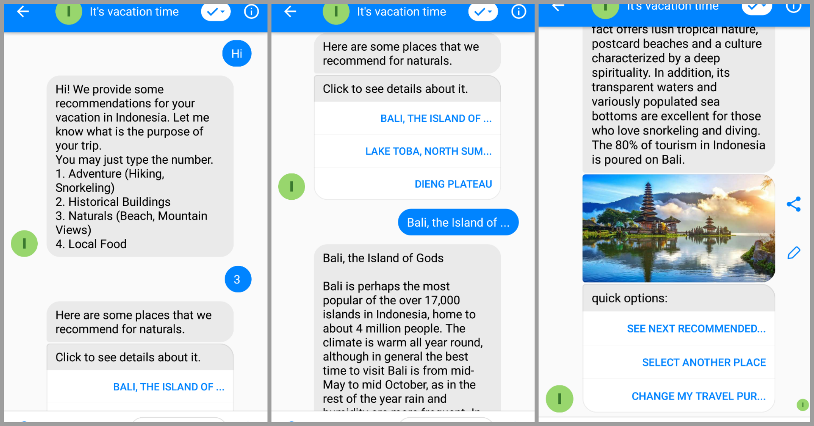

# TOC Chatbot Project 2019

## It's Vacation Time!
I am an international student from Indonesia.
And this chatbot will give you some recommendations about where you can go if you would like to travel to Indonesia. Why I made this chatbot because usually my Taiwanese friends will always ask me about having vacation in Indonesia.

## FSM Generated by GraphMachine


## Redrawn FSM(for better visualization)


## Example interaction with chatbot


## How to interact with this chatbot:
1. First you can message anything to the fanpage https://www.facebook.com/Its-vacation-time-542778936191003/
2. We will ask you the main purpose of your travel. There are four options:
	```
	1. Adventure (Hiking, Snorkeling)
	2. Historical Buildings
	3. Naturals (Beach, Mountain Views)
	4. Local Food
	```

	You can reply by just typing the number(1,2,3,4), or type the keyword(adventure, historical buildings, naturals, local food)

	Both uppercase and lowercase letters are okay.

3. For each category of purpose, we provide 3 recommendations.

	This options are given in **button**.
	You can just click the button or type the place name to see the details about it.
	```
	- Adventure (Hiking, Snorkeling):
		1. Raja Ampat Islands, West Papua
		2. Gili Islands, Lombok
		3. Mount Bromo, East Java
	- Historical Buildings:
		1. Borobudur Temple, Magelang
		2. Prambanan Temple, Yogyakarta
		3. Kota Tua (Old Town), Jakarta
	- Naturals (Beach, Mountain Views):
		1. Bali, the Island of Gods
		2. Lake Toba, North Sumatra
		3. Dieng Plateau
	- Local Food:
		1. Satay
		2. Beef Rendang
		3. Fried Rice
	```
4. After you selected one option, we will send you:
	- The introduction and some tips about visiting this place
	- A **photograph** of the place or food
	- 3 quick options:
		1. See next recommended place or food
			- see details of the next place of the same category\
				e.g. for Adventure category:\
				Raja Ampat -> Gili Islands -> Mount Bromo
		2. Select another place or food
			- Go back to step 3(Select another place or food of the same category)
		3. Change my travel purpose
			- Go back to step 2(Select another category)
			
## Deploy to Heroku
### Webhook
- Callback URL:  https://itsvacationtime.herokuapp.com/webhook
- Verify token: FWy9z9bjutzBb1oLfjt2D

### Push to Heroku
- Install the Heroku CLI

- If you haven't already, log in to your Heroku account and follow the prompts to create a new SSH public key.
    ```sh
    $ heroku login
    ```
- Clone the repository
Use Git to clone itsvacationtime's source code to your local machine.
    ```sh
    $ heroku git:clone -a itsvacationtime
    $ cd itsvacationtime
    ```
- Deploy your changes
Make some changes to the code you just cloned and deploy them to Heroku using Git.
    ```sh
    $ git add .
    $ git commit -am "make it better"
    $ git push heroku master
    ```
- Add heroku environment variables
	```
	heroku config:set VERIFY_TOKEN=FWy9z9bjutzBb1oLfjt2D
	heroku config:set ACCESS_TOKEN=EAAaOfEoALZC0BAHgVj0iaXsr9jaRC1JagSWoSYyZByk3vK2ZCA6E0G6LBzCMcwnzgUnZAyyndlDvmYYqB7CvsxHL53DO1wSA4S7PH4zO2DEsL5fXZCQCHTCzZCWhYzW17rUXr2GN0Bwmiy6pD0OI5ZAOw4AFyFHbSLy1GPqYvZBpzS3PU7lSKpxF
	```
- Webhook -> edit subscription
	- Callback URL:  https://itsvacationtime.herokuapp.com/webhook
	- Verify token: FWy9z9bjutzBb1oLfjt2D

- subscribe fb page to webhook(messenger->settings->webhooks)
    

- Generate token for the page and copy to ACCESS_TOKEN in utils.py
    
